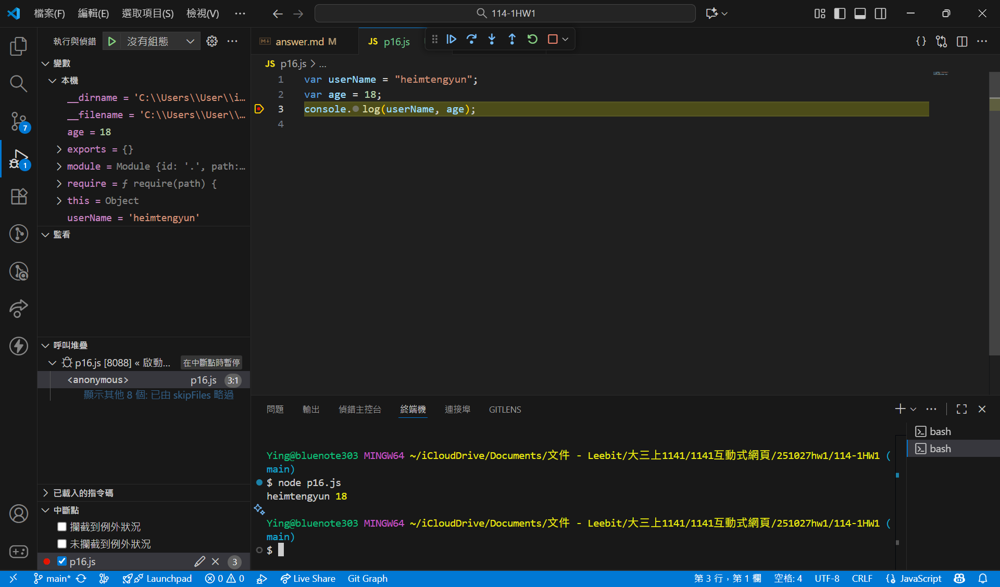
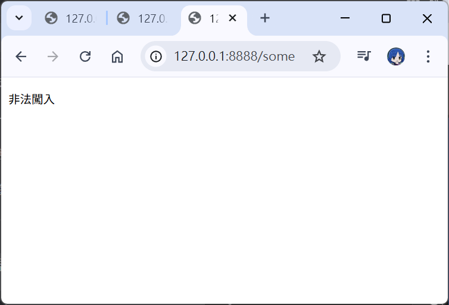
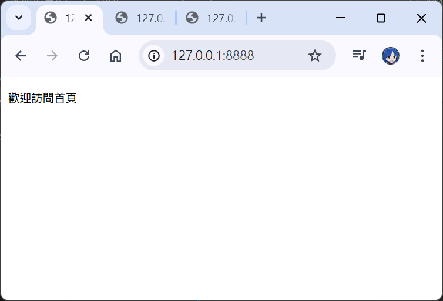
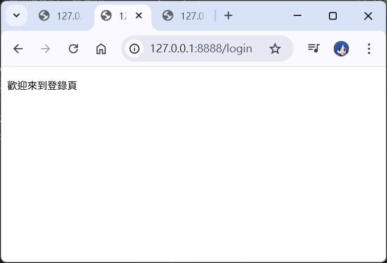

# 第2次隨堂題目-隨堂-QZ2
>
>學號：112111106
> 
>姓名：楊于瑩
> 
>作業撰寫時間：180 (mins，包含程式撰寫時間)
> 
>最後撰寫文件日期：2023/09/22
>

本份文件包含以下主題：(至少需下面兩項，若是有多者可以自行新增)
- [x] 說明內容
- [x] 個人認為完成作業須具備觀念

1. 請撰寫Topic 1的P. 16，並1 寫程式後印出結果，該程式名為p16.js，與2 承1程式碼中的 Line3下中斷點，並印出此時變數age裡面的值為多少觀察。

Ans:

2. 請撰寫Topic 1的P. 19，並1 寫程式後印出結果，該程式名為p19.js，與2 請同樣印出p. 20的三種結果，並說明為何可以造成該種原因

Ans:
 
***非法闖入***
 

程式碼中的 request.url 獲取到的請求位址是 /someurl ，但它沒有匹配任何 case（既不是 / 也不是 /login），因此執行了 default 區塊，設定回應內容為「非法闖入」 。
 
***歡迎來到登錄頁***
 

程式碼中的 request.url 獲取到的請求位址是 / ，而這匹配了 switch 區塊中的 case '/' ，所以設定回應內容為「歡迎訪問首頁」 。
 
***歡迎來到登錄頁***
 

程式碼中的 request.url 獲取到的請求位址是 /login ，此匹配了 switch 區塊中的 case '/login' ，因此設定回應內容為「歡迎來到登錄頁」 。

